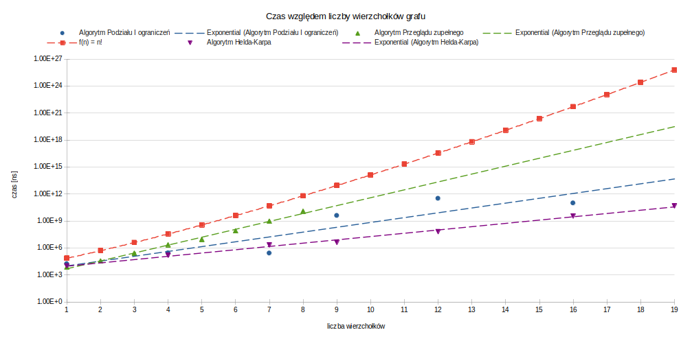
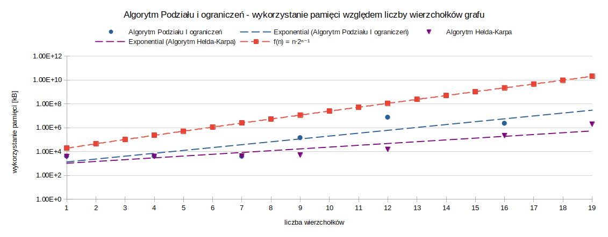
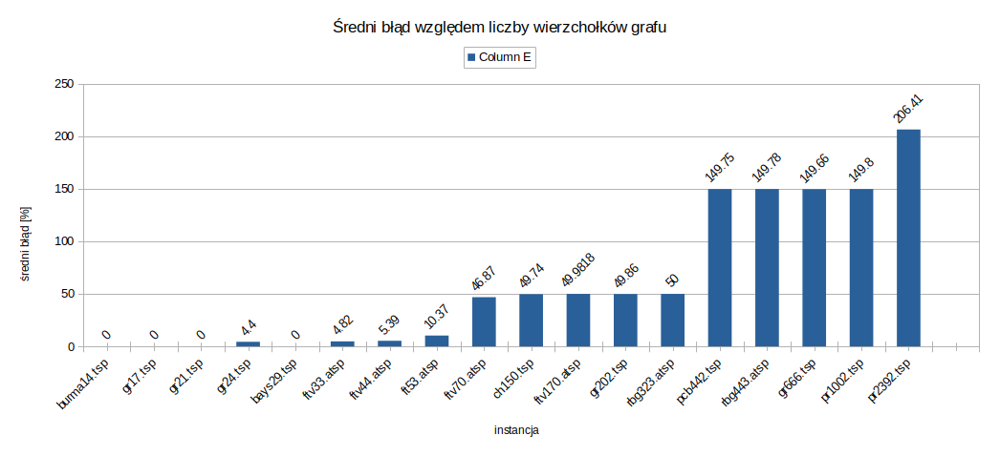
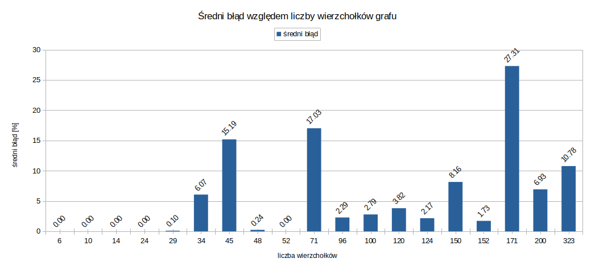

# Optimization - Travelling Salesman Problem

## Links to source code:

- [Brute force](https://github.com/piotrdurniat/tsp-brute-force)
- [Dynamic Programming (Held-Karp Algorithm)](https://github.com/piotrdurniat/tsp-held-karp)
- [Branch and Bound](https://github.com/piotrdurniat/tsp-branch-and-bound)
- [Simulated Annealing](https://github.com/piotrdurniat/tsp-simulated-annealing)
- [Genetic Algorithm](https://github.com/piotrdurniat/tsp-genetic-algorithm)

# Comparison of Exact Algorithms

Comparison of Brute Force, Branch and Bound, and Held-Karp algorithms.

## Time Comparison

The graph below shows the relationship between the algorithm's running time [ns] and the number of vertices in the graph. It includes results for the Brute Force, Branch and Bound, and Held-Karp algorithms. Additionally, an $n!$ curve is superimposed for complexity comparison.

_Figure: Relationship between the execution time of the studied algorithms and the number of graph vertices. Logarithmic scale._

## Memory Usage Comparison

Below is a graph showing the relationship between memory usage and the number of vertices in the graph for the Branch and Bound and Held-Karp algorithms.

_Figure: Relationship between the memory usage of the studied algorithms and the number of graph vertices. Logarithmic scale._

# Comparison of Heuristic Algorithms

Comparison of the Simulated Annealing algorithm and the Genetic algorithm.

## Average Error Results for Final Parameter Selection of Algorithms

### Genetic Algorithm

_Figure: Error magnitude relative to instances for final parameters of the genetic algorithm._

### Simulated Annealing Algorithm

_Figure: Error magnitude for different instances for final parameters of the simulated annealing algorithm._
